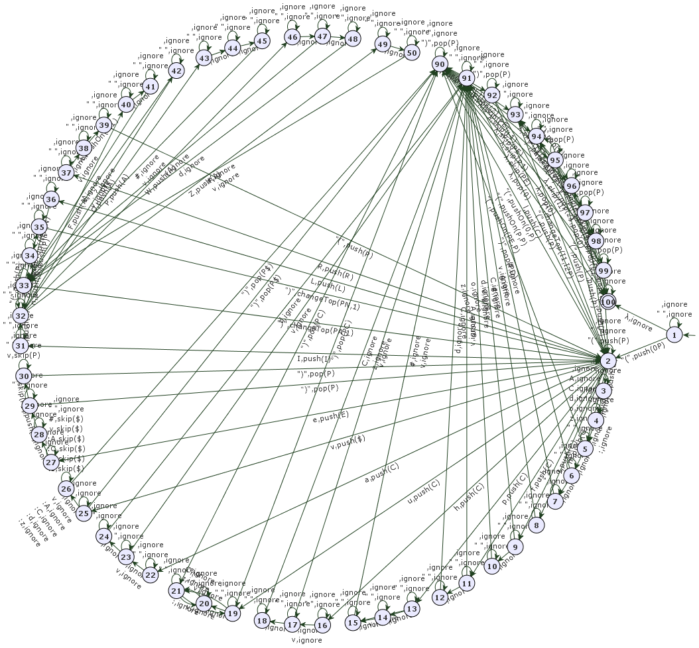

# Proyecto 3 - Lenguajes y Máquinas

Este repositorio contiene un programa GOLD que compila un par Lexer-Parser para un lenguaje de programación específico de un robot en un mundo bidimensional que puede moverse por el tablero e interactuar con objetos de tipo globo o bloque. Está desarrollado utilizando el lenguaje de programación GOLD y el entorno de desarrollo Eclipse Kepler.

## Descripción

El Lexer-Parser es capaz de analizar programas escritos en un lenguaje de robot y determinar si son válidos o no. El proceso incluye la tokenización del código fuente (Lexer) y la validación de la estructura sintáctica (Parser). El Lexer se encuentra implementado mediante un Autómata con Respuesta (Transducidor) cuyo retorno es una cadena tokenizada del programa original. Por su parte, el Parser se encuentra implementado mediante un Autómata de Pila (Pushdown) cuyo retorno es un valor booleano, dependiendo de si acepta o rechaza la tokenización correspondiente del Lexer.

## Instrucciones de Ejecución

### Paso 1: Abrir Eclipse Kepler

1. Se debe correr necesariamente sobre el programa Eclipse Kepler que contiene un JAR ejecutable del lenguaje GOLD 3.

### Paso 2: Correr el archivo LexerParserRobot2410.gold

1. Dentro de Eclipse Kepler, abrir el archivo `LexerParserRobot2410.gold`.
2. Ejecutar el archivo SIN argumentos.

### Paso 3: Ingresar un programa

1. Escribir un programa válido o no válido en la consola de Eclipse. Finaliza el programa con un salto de línea con el caracter `$`.

### Paso 4: Seleccionar opción de análisis

1. En el menú que aparece al dar ENTER, seleccionar una de las siguientes opciones:
    - **1**: Solo Lexer
    - **2**: Lexer y Parser
    - **3**: Solo Parser

### Visualización del Token Stream

1. Si selecciona la opción **1** o **2**, se mostrará el Token Stream en la consola.

### Paso 5: Ejecutar el Parser desde el visualizador de Autómatas

1. Abrir el menú `Tools` y selecciona `Run Automaton`.
2. Pegar el Token Stream (sin el caracter final `$`) en el cuadro de texto.
3. Ejecutar el autómata utilizando los botones de la interfaz hasta que finalice el procesamiento del token stream.

### Resultados

1. Al finalizar, se mostrará "Accepted" o "Rejected" tanto para el Lexer como para el Parser, indicando si el programa ingresado es válido o no.
Esto se puede visualizar tanto en consola como en la interfaz.

## Visualización del Autómata

La imagen del parser se encuentra en la carpeta `docs/` con el nombre `P3-Automata.png`:

La carpeta de docs contiene adicionalmente tres documentos con casos de prueba:
- `test1.txt`: Caso de prueba correcto modular y globalmente.
- `test2.txt`: Caso de prueba correcto modular y globalmente.
- `wrong.txt`: Caso de prueba no válido. Cada instrucción es incorrecta.

## Autores

Carol Florido - 202111430
\
Nicolás Rincón - 202021963